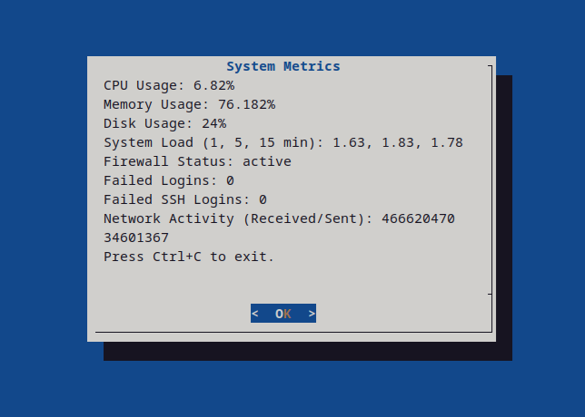
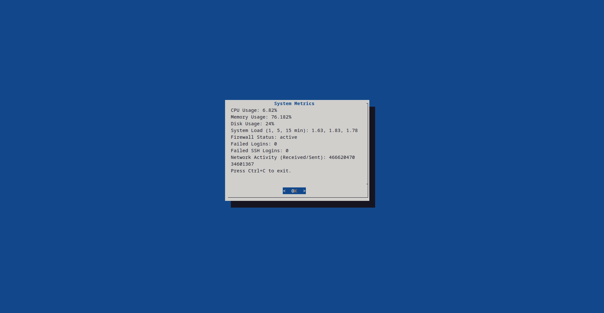

# System Monitoring Script using Bash and Dialog

This project implements a custom monitoring script for a Linux-based system. The purpose of this script is to collect system metrics, store them in a CSV file, and send email notifications for critical system states, such as high resource usage or security concerns. The script is run periodically using cron jobs, ensuring that system health is regularly monitored.

## Metrics Collected

The script tracks the following key system metrics:

1. **CPU Usage**: High CPU usage can indicate an overloaded system, or that processes are consuming excessive resources. By tracking this, I can be alerted to potential issues that could affect system performance.
   
2. **Memory Usage**: Similarly to CPU usage, high memory consumption is a common sign of system strain. It can be caused by memory leaks or a lack of available RAM, both of which can lead to system slowdowns or crashes.
   
3. **Disk Usage**: Full disks can severely impact system performance, potentially causing crashes or failures. Monitoring disk usage helps in preventing these critical situations.
   
4. **System Load**: The 1, 5, and 15-minute load averages provide an overview of the system's current processing load. It's useful for detecting if the system is overburdened or if it is handling more tasks than it can process efficiently.

5. **Firewall Status**: Ensuring the firewall is active is crucial for system security. An inactive firewall might expose the system to unnecessary risks, so this check is essential for maintaining a secure environment.

6. **Failed Login Attempts**: This metric tracks failed login attempts, which could indicate a brute force attack or other unauthorised access attempts. Monitoring failed login attempts helps identify potential security issues early.

7. **Failed SSH Logins**: Similar to failed login attempts, this tracks failed SSH logins specifically, which is often targeted by attackers trying to gain remote access.

8. **Network Activity**: Monitoring network traffic (bytes received and sent) helps detect unusual patterns that might suggest malicious activity or network congestion.

~~~
# Collect system metrics
CPU_USAGE=$(mpstat 1 1 | grep "Average" | awk '{print 100 - $12}')
MEMORY_USAGE=$(free | grep Mem | awk '{print $3/$2 * 100.0}')
DISK_USAGE=$(df / | tail -1 | awk '{print $5}' | sed 's/%//')

# System load (1, 5, 15 minute load averages)
SYSTEM_LOAD=$(uptime | awk -F'load average: ' '{ print $2 }')

# Firewall status check: Check if any rules exist in iptables
FIREWALL_STATUS=$(sudo iptables -L | grep -i "Chain" | wc -l)
if (( FIREWALL_STATUS > 0 )); then
    FIREWALL_STATUS="active"
else
    FIREWALL_STATUS="inactive"
fi

# Count failed login attempts (excluding SSH) since the last run
FAILED_LOGINS=$(sudo grep -i "Failed password" /var/log/auth.log | grep -v "sshd" | awk -v last_run="$LAST_RUN_TIMESTAMP" '$0 ~ last_run {print $0}' | wc -l)

# Count failed SSH login attempts since the last run
FAILED_SSH_LOGINS=$(sudo grep -i "Failed password" /var/log/auth.log | grep -i "sshd" | awk -v last_run="$LAST_RUN_TIMESTAMP" '$0 ~ last_run {print $0}' | wc -l)

# Network activity (bytes received and sent)
NET_STATS=$(cat /proc/net/dev | grep -i 'enp0s3' | awk '{print $2,$10}')
~~~

## Email Notifications

The script sends email notifications if any of the following conditions are met:
- **High CPU Usage**: If CPU usage exceeds 90%, an email alert is triggered to notify about potential performance issues.
- **High Memory Usage**: Memory usage over 90% triggers an email to prevent system crashes.
- **High Disk Usage**: Disk usage over 90% is critical, and the script notifies me of the need to clean up space.
- **Firewall Inactivity**: If the firewall is inactive, this is flagged as a critical security issue.
- **Multiple Failed Login Attempts**: More than 3 failed login attempts, whether via SSH or other means, are considered suspicious and trigger an alert.

~~~
# Check if any metrics exceed thresholds and trigger email notifications
NOTIFY=""

if (( $(echo "$CPU_USAGE > 90" | bc -l) )); then
    NOTIFY="CPU usage is above 90%: $CPU_USAGE%"
fi

if (( $(echo "$MEMORY_USAGE > 90" | bc -l) )); then
    NOTIFY="Memory usage is above 90%: $MEMORY_USAGE%"
fi

if (( DISK_USAGE > 90 )); then
    NOTIFY="Disk usage is above 90%: $DISK_USAGE%"
fi

if [[ "$FIREWALL_STATUS" == "inactive" ]]; then
    NOTIFY="Firewall is inactive"
fi

if (( FAILED_LOGINS > 3 )); then
    NOTIFY="More than 3 failed login attempts: $FAILED_LOGINS"
fi

if (( FAILED_SSH_LOGINS > 3 )); then
    NOTIFY="More than 3 failed SSH login attempts: $FAILED_SSH_LOGINS"
fi

# If any condition triggered, send an email
if [[ -n "$NOTIFY" ]]; then
    send_email "$NOTIFY"
fi
~~~

## Weekly System Report

The script generates a weekly system report and sends it to my email. This includes:
- The top 10 running processes for the week (to identify any unusual or resource-heavy processes).
- A summary of the system metrics logged during the week, allowing me to track overall system health.

~~~
# Weekly report generation
if [[ "$(date +%u)" -eq 7 ]]; then
    REPORT="Weekly System Report\n\nTop 10 Processes:\n$TOP_PROCESSES\n\nMetrics for the past week:\n$(cat "$CSV_FILE")"
    send_email "$REPORT"
fi
~~~

## User Interface

Instead of using pre-built graphical monitoring tools, I opted for an interactive `dialog` interface that provides a clean and concise overview of the system's current state. The use of `dialog` ensures that I can quickly view the metrics in a user-friendly, terminal-based environment. This choice aligns with the exercise's goal to build a custom, hands-on monitoring solution rather than relying on pre-made solutions.

## Why This Approach?

This monitoring script is designed to:
- Be simple yet effective in tracking key system health indicators.
- Provide email notifications for critical issues, ensuring timely action can be taken to prevent system failures.
- Store the metrics in a CSV file for historical tracking and analysis.
- Provide an interactive interface that presents system metrics in a readable, real-time format.

By customising this monitoring solution, I gain a deeper understanding of system resource management and the value of proactive monitoring. It also offers flexibility, allowing for further improvements or modifications as new needs arise.
